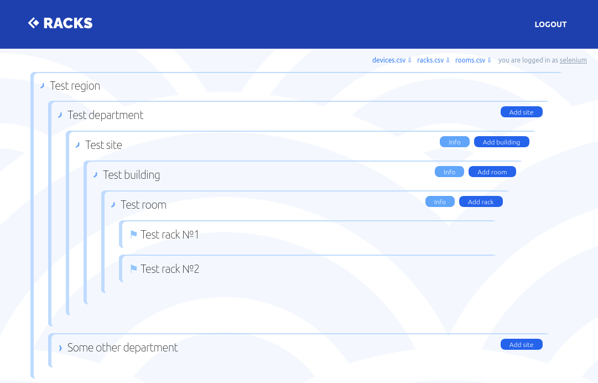
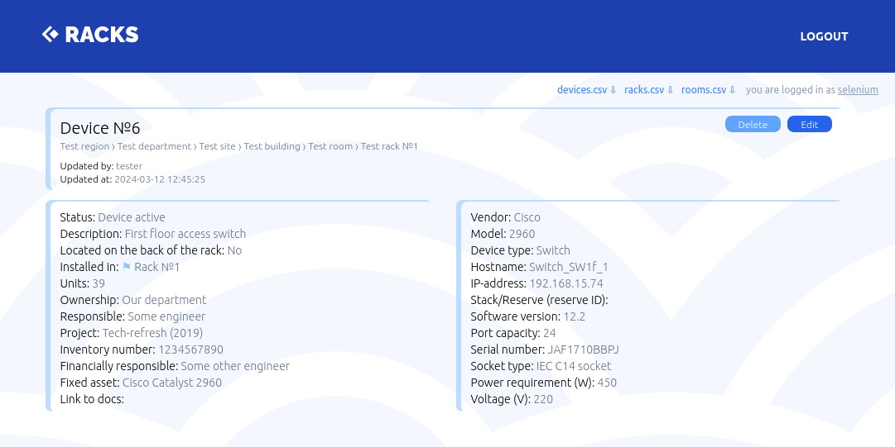

# Racks
**Racks** is a prototype of a space accounting system for telecommunication cabinets and racks.  

    
   


     
     
        
   

```
━━━━━━━━━━━━━━━━━━━━━━━━━━━━━━━━━━━━━━━━━━━━━━━━━━━━━━━━━━━━━━━━━━━━━━━━━━━━━━━
 Language            Files        Lines         Code     Comments       Blanks
━━━━━━━━━━━━━━━━━━━━━━━━━━━━━━━━━━━━━━━━━━━━━━━━━━━━━━━━━━━━━━━━━━━━━━━━━━━━━━━
 BASH                    4           68           48            4           16
 Dockerfile              7          318          246            1           71
 PHP                   586        47848        25202        17208         5438
 Python                 11          870          767            5           98
 Shell                   3          182          142           17           23
───────────────────────────────────────────────────────────────────────────────
 Vue                    37          936          889            0           47
 |- CSS                 10          107          107            0            0
 |- HTML                37         1411         1411            0            0
 |- JavaScript          37         2673         2404          234           35
 (Total)                           5127         4811          234           82
━━━━━━━━━━━━━━━━━━━━━━━━━━━━━━━━━━━━━━━━━━━━━━━━━━━━━━━━━━━━━━━━━━━━━━━━━━━━━━━
 Total                 648        54413        31216        17469         5728
━━━━━━━━━━━━━━━━━━━━━━━━━━━━━━━━━━━━━━━━━━━━━━━━━━━━━━━━━━━━━━━━━━━━━━━━━━━━━━━
 384 tests, 1033 assertions
```

## For dev environment:
Needs `docker` and `laravel/sail` to be installed.
```
./vendor/bin/sail up
```

## build_and_test.sh:

Check `NUMBER_OF_THREADS` and `SHM_SIZE` envs before start!  
HTML-reports and screenshots are stored in relevant docker volumes. Each run logs stored in `./build_logs` directory.

## CLI:
Administrative purpose commands for artisan via sail:
```
./vendor/bin/sail artisan `command` {args}
```
Region:
```
region:create {name : Region name}
region:delete {id : Region ID}
region:update {id : Region ID} {name : Region name}
```
Department:
```
department:create {name : Department name} {region_id : Region ID}
department:delete {id : Department ID}
department:update {id : Department ID} {name : Department name}
```
User:
```
user:create {name : User name} {full_name : User full name} {email : User email} {department_id : Department ID}
user:delete {id : User ID}
user:reset_password {id : User ID}
user:update {id : User ID} {name : User name} {full_name : User full name} {email : User email} {department_id : Department ID}
```

## Docs:
### Swagger:
```
http://localhost:80/api/documentation
```
### Business rules example:
[/app/Domain/Interfaces/RackInterfaces/RackBusinessRules.php](/app/Domain/Interfaces/RackInterfaces/RackBusinessRules.php)

## Models graph:
|  |
|:-------------------:|

## Screenshots:
|  |
|:--:| 
| *Racks map* |

|  |
|:--:| 
| *Rack scheme* |

|  |
|:--:| 
| *Device card* |


